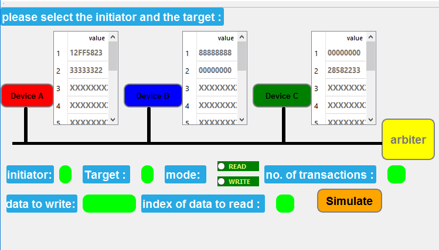
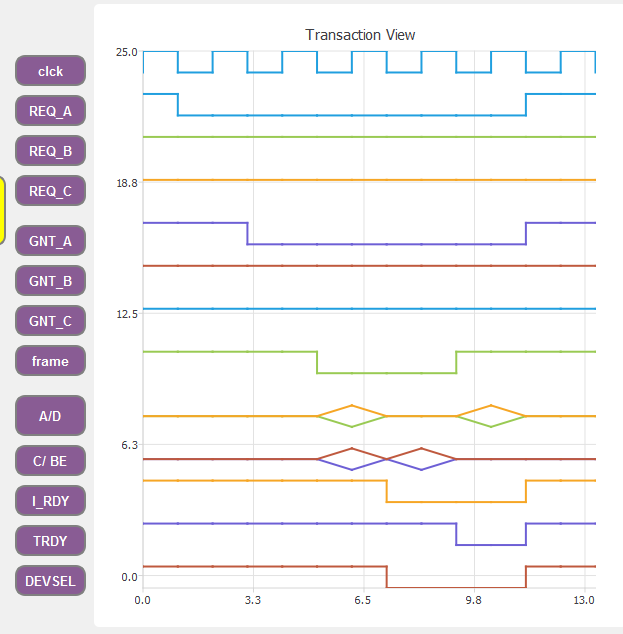

## We’re Building an Open Source CI-Peripheral-Component-Interconnect

<h2>The project is divide into 3 parts :</h2>
<h2>The first one :</h2>
    
the veilog (hard ware description language) of the PCI Bus and how the Devices will deal with Arbiter Circuit .

<h2>The Second Part :</h2> 
    
A c++ QT GUI that show the connection of the pci and the changing in signals and memory while diffrent transactions .

<h2>The Third Part :</h2> 
    
Responsive website for next generation to completely describe the project .

## How to Run
-for the hardware (verilog) code you will need to copy it in modelsim or xilion and debug in it
-for the GUI you can run the excutable file only .
-for web

#### Challenges
Hardware : it was diffecult to make diffrent modes from the Arbiter Circuit like : (Round Roben - First Come First Serve - Piroity ) and also about how to make the device handle all the cases and communicate with the device to read and write 
GUI : it make instance of 3 devices with the arbiter and it enable you to read and to write and show you the signals and waveforms .

**You can find the output in the following pictures.**

THe GUI :
from here you can choose the mode and device to read and write and see the memory of each device 

 
after you click simulate you will see the wave forms that show each signal in the BUS 

 
the gui support read mode write mode for 3 transactions and 3 devices memory
the gui support animation dynamic while drawing the waveforms 
## Link simuation
[@PCI Project](https://youtu.be/sONV1r9ypZ0) 
